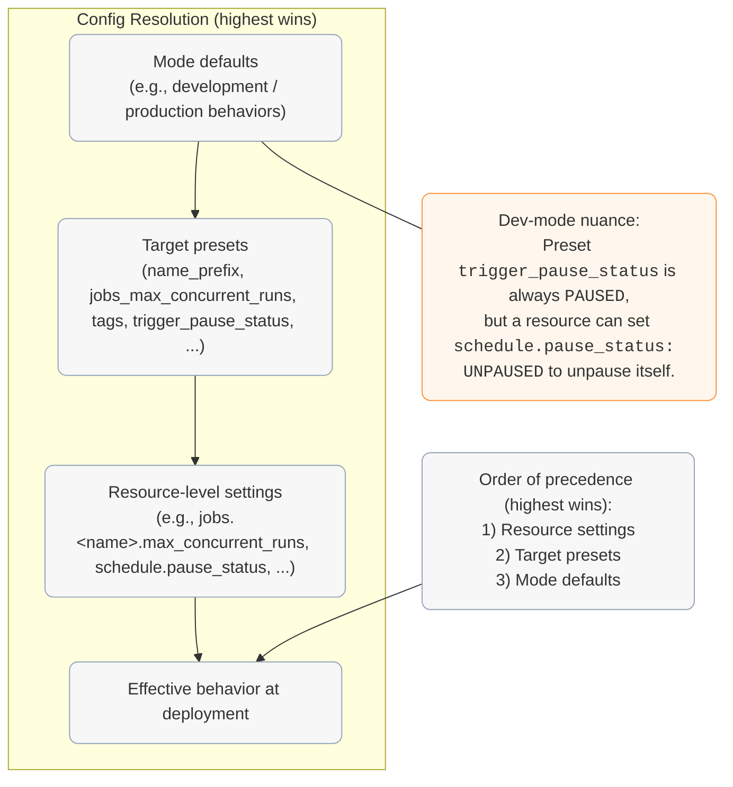
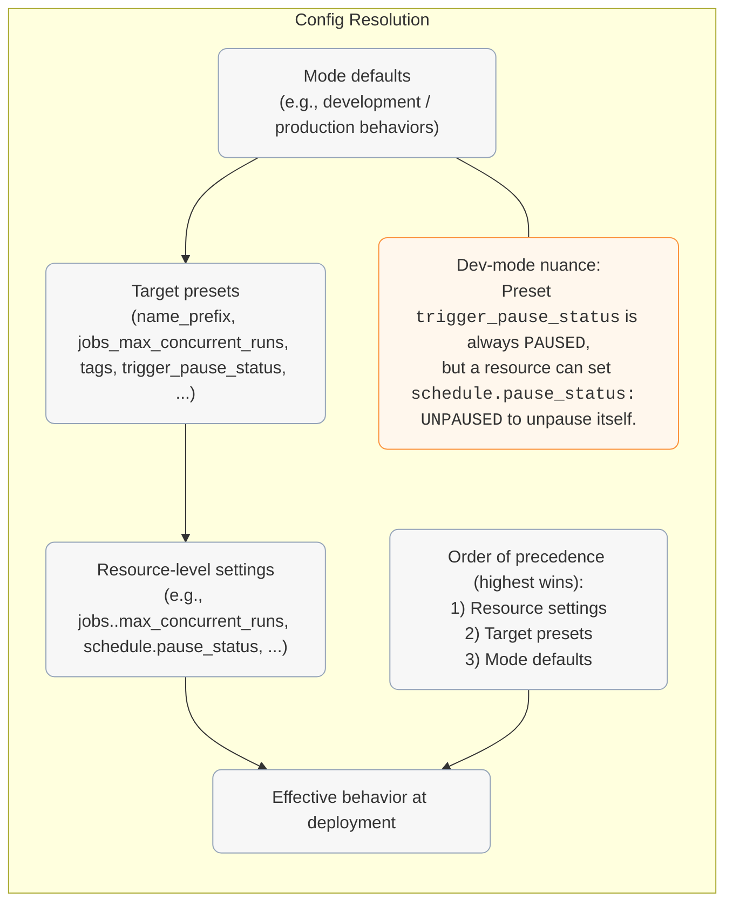
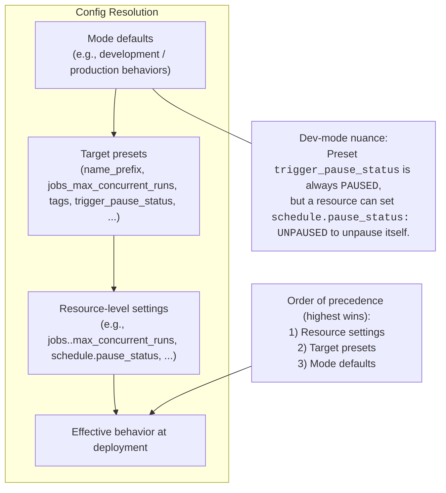
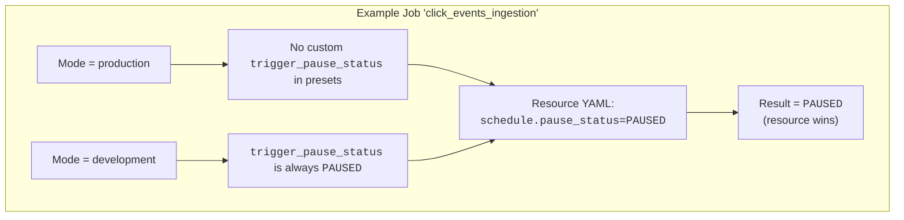
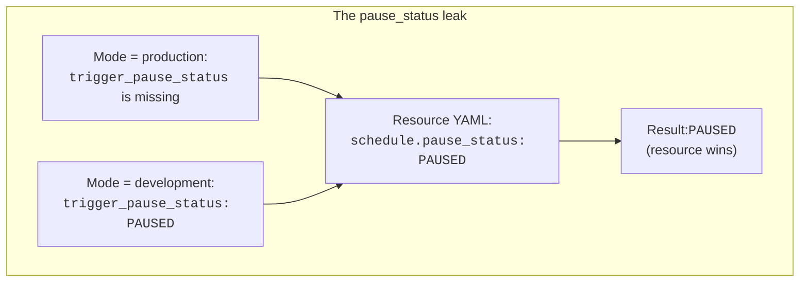
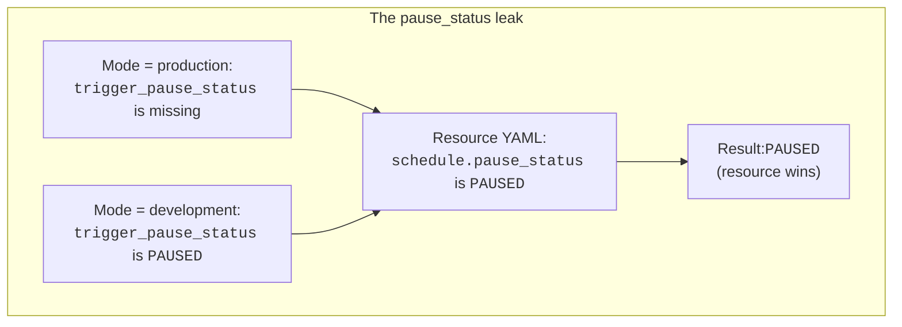

This is my test post on the new blog.

### Content Organization

Here is a placeholder for a co-located image:



Diagram:






---








- `${bundle.name}` – Your bundle's name. Great for artifact names, paths, and tags.
- `${bundle.target}` – The active target (dev/stage/prod). Use this to suffix schemas, tables, paths. Prefer it over the older `${bundle.environment}`.
- `${workspace.current_user.short_name}` – Username token (e.g., `vadym_mariiechko`). Perfect for `name_prefix` and ownership tags.
- `${workspace.current_user.domain_friendly_name}` – Like `short_name`, but replaces hyphens with underscores (e.g., `vadym-mariiechko` → `vadym_mariiechko`). Better choice for schema names and paths where hyphens cause trouble.
- `${workspace.current_user.userName}` – Full login (often an email). Handy for `owner` tags or per-user workspace paths.
- `${workspace.host}` – Workspace base URL. Useful for links or metadata.
- `${workspace.root_path}` – The bundle's root in the workspace. Defaults to `/Workspace/Users/${workspace.current_user.userName}/.bundle/${bundle.name}/${bundle.target}`.
- `${workspace.file_path}` – Where the CLI syncs your code; effectively `<root_path>/files`. Use when referencing notebooks or scripts in resources.

---

- `${bundle.name}`: your bundle's name. Great for artifact names, paths, and tags.
- `${bundle.target}`: the active target (dev/stage/prod). Use this to suffix schemas, tables, paths. Prefer it over the older `${bundle.environment}`.
- `${workspace.current_user.short_name}`: username token (e.g., `vadym_mariiechko`). Perfect for `name_prefix` and ownership tags.
- `${workspace.current_user.domain_friendly_name}`: like `short_name`, but replaces hyphens with underscores (e.g., `vadym-mariiechko` → `vadym_mariiechko`). Better choice for schema names and paths where hyphens cause trouble.
- `${workspace.current_user.userName}`: full login (often an email). Handy for `owner` tags or per-user workspace paths.
- `${workspace.host}`: workspace base URL. Useful for links or metadata.
- `${workspace.root_path}`: the bundle's root in the workspace. Defaults to `/Workspace/Users/${workspace.current_user.userName}/.bundle/${bundle.name}/${bundle.target}`.
- `${workspace.file_path}`: where the CLI syncs your code; effectively `<root_path>/files`. Use when referencing notebooks or scripts in resources.

| Variable | Description |
|----------|-------------|
| `${bundle.name}` | your bundle's name. Great for artifact names, paths, and tags. |
| `${bundle.target}` | the active target (dev/stage/prod). Use this to suffix schemas, tables, paths. Prefer it over the older `${bundle.environment}`. |
| `${workspace.current_user.short_name}` | username token (e.g., `vadym_mariiechko`). Perfect for `name_prefix` and ownership tags. |
| `${workspace.current_user.domain_friendly_name}` | like `short_name`, but replaces hyphens with underscores (e.g., `vadym-mariiechko` → `vadym_mariiechko`). Better choice for schema names and paths where hyphens cause trouble. |
| `${workspace.current_user.userName}` | full login (often an email). Handy for `owner` tags or per-user workspace paths. |
| `${workspace.host}` | workspace base URL. Useful for links or metadata. |
| `${workspace.root_path}` | the bundle's root in the workspace. Defaults to `/Workspace/Users/${workspace.current_user.userName}/.bundle/${bundle.name}/${bundle.target}`. |
| `${workspace.file_path}` | where the CLI syncs your code; effectively `<root_path>/files`. Use when referencing notebooks or scripts in resources. |


**Articles & posts**

- [CI/CD Strategies for Databricks Asset Bundles](https://towardsdev.com/ci-cd-strategies-for-databricks-asset-bundles-e4aaf921823e)

  Goes deeper on CI/CD than this article: bundle versioning, git tag strategies, and deployment pipeline design.

- [Customizing Target Deployments in Databricks Asset Bundles](https://community.databricks.com/t5/technical-blog/customizing-target-deployments-in-databricks-asset-bundles/ba-p/124772)

  Community post on target-level resource customization. Introduces per-environment resource folders, worth considering as your project grows.
- [Master Asset Bundles Today](https://www.advancinganalytics.co.uk/blog/master-asset-bundles-today)

  Another take on the same problem. Their point about `mode: development` being confusing is what pushed me toward naming the personal target `user` instead of `dev`.

- [Parameterised Databricks Asset Bundles](https://www.advancinganalytics.co.uk/blog/avoid-delta-live-table-conflicts-with-databricks-asset-bundles)

  Companion to the article above, goes deeper on CI/CD and parameterization. If you want another perspective on GitOps with DABs, this is it.

- [3 Die-Hard Lessons Using Databricks Asset Bundles](https://rabobank.jobs/en/techblog/3-die-hard-lessons-we-ve-learned-when-using-databricks-asset-bundles/)

  Field lessons from a team hitting real limits. The API rate-limiting gotcha is worth knowing about before you scale.

- [Scaling Data Engineering Workflows with Asset Bundles](https://medium.com/backstage-stories/scaling-data-engineering-workflows-with-asset-bundles-in-databricks-34c4d910ef08)

  Tackles the same developer-stepping-on-toes problem, but in a more concise format. I found it after writing this article — different delivery, similar message.

---

**Articles & posts**

<details>
<summary><a href="https://towardsdev.com/ci-cd-strategies-for-databricks-asset-bundles-e4aaf921823e">CI/CD Strategies for Databricks Asset Bundles</a></summary>
Goes deeper on CI/CD than this article: bundle versioning, git tag strategies, and deployment pipeline design.
</details>

<details>
<summary><a href="https://community.databricks.com/t5/technical-blog/customizing-target-deployments-in-databricks-asset-bundles/ba-p/124772">Customizing Target Deployments in Databricks Asset Bundles</a></summary>
Community post on target-level resource customization. Introduces per-environment resource folders, worth considering as your project grows.
</details>

<details>
<summary><a href="https://www.advancinganalytics.co.uk/blog/master-asset-bundles-today">Master Asset Bundles Today</a></summary>
Another take on the same problem. Their point about `mode: development` being confusing is what pushed me toward naming the personal target `user` instead of `dev`.
</details>

<details>
<summary><a href="https://www.advancinganalytics.co.uk/blog/avoid-delta-live-table-conflicts-with-databricks-asset-bundles">Parameterised Databricks Asset Bundles</a></summary>
Companion to the article above, goes deeper on CI/CD and parameterization. If you want another perspective on GitOps with DABs, this is it.
</details>

<details>
<summary><a href="https://rabobank.jobs/en/techblog/3-die-hard-lessons-we-ve-learned-when-using-databricks-asset-bundles/">3 Die-Hard Lessons Using Databricks Asset Bundles</a></summary>
Field lessons from a team hitting real limits. The API rate-limiting gotcha is worth knowing about before you scale.
</details>

<details>
<summary><a href="https://medium.com/backstage-stories/scaling-data-engineering-workflows-with-asset-bundles-in-databricks-34c4d910ef08">Scaling Data Engineering Workflows with Asset Bundles</a></summary>
Tackles the same developer-stepping-on-toes problem, but in a more concise format. I found it after writing this article — different delivery, similar message.
</details>


---


- [CI/CD Strategies for Databricks Asset Bundles](https://towardsdev.com/ci-cd-strategies-for-databricks-asset-bundles-e4aaf921823e): goes deeper on CI/CD than this article: bundle versioning, git tag strategies, and deployment pipeline design.
- [Customizing Target Deployments in Databricks Asset Bundles](https://community.databricks.com/t5/technical-blog/customizing-target-deployments-in-databricks-asset-bundles/ba-p/124772): community post on target-level resource customization. Introduces per-environment resource folders, worth considering as your project grows.
- [Master Asset Bundles Today](https://www.advancinganalytics.co.uk/blog/master-asset-bundles-today): another take on the same problem. Their point about `mode: development` being confusing is what pushed me toward naming the personal target `user` instead of `dev`.
- [Parameterised Databricks Asset Bundles](https://www.advancinganalytics.co.uk/blog/avoid-delta-live-table-conflicts-with-databricks-asset-bundles): companion to the article above, goes deeper on CI/CD and parameterization. If you want another perspective on GitOps with DABs, this is it.
- [3 Die-Hard Lessons Using Databricks Asset Bundles](https://rabobank.jobs/en/techblog/3-die-hard-lessons-we-ve-learned-when-using-databricks-asset-bundles/): field lessons from a team hitting real limits. The API rate-limiting gotcha is worth knowing about before you scale.
- [Scaling Data Engineering Workflows with Asset Bundles](https://medium.com/backstage-stories/scaling-data-engineering-workflows-with-asset-bundles-in-databricks-34c4d910ef08): tackles the same developer-stepping-on-toes problem, but in a more concise format. I found it after writing this article — different delivery, similar message.

---

- [CI/CD Strategies for Databricks Asset Bundles](https://towardsdev.com/ci-cd-strategies-for-databricks-asset-bundles-e4aaf921823e) · goes deeper on CI/CD than this article · bundle versioning, git tag strategies, and deployment pipeline design.
- [Customizing Target Deployments in Databricks Asset Bundles](https://community.databricks.com/t5/technical-blog/customizing-target-deployments-in-databricks-asset-bundles/ba-p/124772) · community post on target-level resource customization. Introduces per-environment resource folders, worth considering as your project grows.
- [Master Asset Bundles Today](https://www.advancinganalytics.co.uk/blog/master-asset-bundles-today) · another take on the same problem. Their point about `mode · development` being confusing is what pushed me toward naming the personal target `user` instead of `dev`.
- [Parameterised Databricks Asset Bundles](https://www.advancinganalytics.co.uk/blog/avoid-delta-live-table-conflicts-with-databricks-asset-bundles) · companion to the article above, goes deeper on CI/CD and parameterization. If you want another perspective on GitOps with DABs, this is it.
- [3 Die-Hard Lessons Using Databricks Asset Bundles](https://rabobank.jobs/en/techblog/3-die-hard-lessons-we-ve-learned-when-using-databricks-asset-bundles/) · field lessons from a team hitting real limits. The API rate-limiting gotcha is worth knowing about before you scale.
- [Scaling Data Engineering Workflows with Asset Bundles](https://medium.com/backstage-stories/scaling-data-engineering-workflows-with-asset-bundles-in-databricks-34c4d910ef08) · tackles the same developer-stepping-on-toes problem, but in a more concise format. I found it after writing this article — different delivery, similar message.

---

- [CI/CD Strategies for Databricks Asset Bundles](https://towardsdev.com/ci-cd-strategies-for-databricks-asset-bundles-e4aaf921823e) → goes deeper on CI/CD than this article → bundle versioning, git tag strategies, and deployment pipeline design.
- [Customizing Target Deployments in Databricks Asset Bundles](https://community.databricks.com/t5/technical-blog/customizing-target-deployments-in-databricks-asset-bundles/ba-p/124772) → community post on target-level resource customization. Introduces per-environment resource folders, worth considering as your project grows.
- [Master Asset Bundles Today](https://www.advancinganalytics.co.uk/blog/master-asset-bundles-today) → another take on the same problem. Their point about `mode → development` being confusing is what pushed me toward naming the personal target `user` instead of `dev`.
- [Parameterised Databricks Asset Bundles](https://www.advancinganalytics.co.uk/blog/avoid-delta-live-table-conflicts-with-databricks-asset-bundles) → companion to the article above, goes deeper on CI/CD and parameterization. If you want another perspective on GitOps with DABs, this is it.
- [3 Die-Hard Lessons Using Databricks Asset Bundles](https://rabobank.jobs/en/techblog/3-die-hard-lessons-we-ve-learned-when-using-databricks-asset-bundles/) → field lessons from a team hitting real limits. The API rate-limiting gotcha is worth knowing about before you scale.
- [Scaling Data Engineering Workflows with Asset Bundles](https://medium.com/backstage-stories/scaling-data-engineering-workflows-with-asset-bundles-in-databricks-34c4d910ef08) → tackles the same developer-stepping-on-toes problem, but in a more concise format. I found it after writing this article — different delivery, similar message.

---

- [CI/CD Strategies for Databricks Asset Bundles](https://towardsdev.com/ci-cd-strategies-for-databricks-asset-bundles-e4aaf921823e) | goes deeper on CI/CD than this article | bundle versioning, git tag strategies, and deployment pipeline design.
- [Customizing Target Deployments in Databricks Asset Bundles](https://community.databricks.com/t5/technical-blog/customizing-target-deployments-in-databricks-asset-bundles/ba-p/124772) | community post on target-level resource customization. Introduces per-environment resource folders, worth considering as your project grows.
- [Master Asset Bundles Today](https://www.advancinganalytics.co.uk/blog/master-asset-bundles-today) | another take on the same problem. Their point about `mode | development` being confusing is what pushed me toward naming the personal target `user` instead of `dev`.
- [Parameterised Databricks Asset Bundles](https://www.advancinganalytics.co.uk/blog/avoid-delta-live-table-conflicts-with-databricks-asset-bundles) | companion to the article above, goes deeper on CI/CD and parameterization. If you want another perspective on GitOps with DABs, this is it.
- [3 Die-Hard Lessons Using Databricks Asset Bundles](https://rabobank.jobs/en/techblog/3-die-hard-lessons-we-ve-learned-when-using-databricks-asset-bundles/) | field lessons from a team hitting real limits. The API rate-limiting gotcha is worth knowing about before you scale.
- [Scaling Data Engineering Workflows with Asset Bundles](https://medium.com/backstage-stories/scaling-data-engineering-workflows-with-asset-bundles-in-databricks-34c4d910ef08) | tackles the same developer-stepping-on-toes problem, but in a more concise format. I found it after writing this article — different delivery, similar message.


---

<details>
<summary>Bonus: How to look them up yourself</summary>

Run this and scroll to the `workspace` block at the bottom — you'll see concrete resolved values for `current_user.*`, `host`, and workspace paths for the current target:

```bash
databricks bundle validate -t <target_name> --output json
```

For a comprehensive list of every possible resolved field across all resource types (`resources.jobs.*`, `resources.pipelines.*`, `resources.volumes.*`, etc.), Databricks maintains an exhaustive reference in the [CLI repository `out.fields.txt](https://github.com/databricks/cli/blob/main/acceptance/bundle/refschema/out.fields.txt)`. I haven't had a need to dig that deep, but it's there if you're curious.

</details>

Substitutions give you built-in dynamic values. But what about your own project-specific values? <"That's where custom variables come in — because apparently, there's no such thing as too many variables.", "That's where custom variables come in — variables all the way down.", "Enter custom variables. Because one type of variable is never enough.">

---

:::callout-info
**Rule of thumb:** Put environment-specific behavior at the **environment level**.
- **Dev-only** → configure in the **dev target** (mode/presets).
- **Stage-only** → configure in the **stage target** (mode/presets).
- **Prod-only** → configure in the **prod target** (mode/presets).
Avoid hard-coding env-only settings on shared **resource** definitions.
:::


Here is the `variable_name` styled.


## Resources: what gets deployed

Each resource file defines a shared base configuration. Targets override only what changes.


| Resource File                | Type          | What It Does                                        |
| ---------------------------- | ------------- | --------------------------------------------------- |
| `*_ingestion.job.yml`        | Job (2 tasks) | Ingests sample data to bronze, transforms to silver |
| `*_pipeline.pipeline.yml`    | Lakeflow SDP  | Reads bronze and silver notebooks                   |
| `*_pipeline_trigger.job.yml` | Job (1 task)  | Scheduled trigger for the pipeline                  |
| `schemas.yml`                | UC Schemas    | Bronze, silver, gold with environment metadata      |

---

## ... vs …

Anyway, where do we start… 1 million years ago? No? Okay, let’s pick a more realistic point...


---

Do not use some weird characters like “” or ’ but use normal common ones "" and '

and then he said “I’m going to the store”
vs.
and then he said "I'm going to the store"