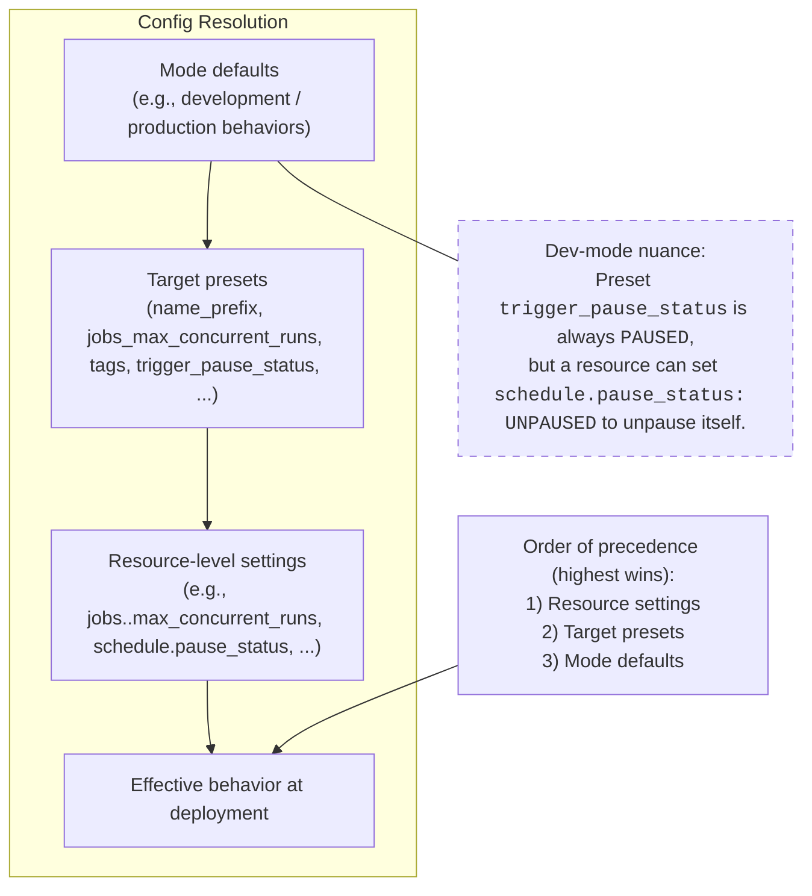
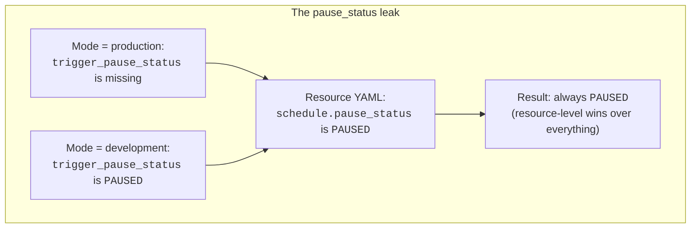

Working as a team on Databricks can get messy fast. "What was that job I deployed yesterday?" "How do we develop without stepping on each other?" "How do we separate staging from production in the same workspace?" If any of those sound familiar, this article is for you.

## TL;DR

- **Use deployment modes.** A `user` target in development mode for personal iteration, shared `stage`/`prod` targets in production mode managed by CI/CD. Don't hard-code environment-specific settings at the resource level, put them in target presets.
- **Isolate developers with schema-per-user.** Everyone shares the same dev catalog, but the `user` target prefixes schema names with the developer's username (e.g., `vadym_bronze`, `vadym_silver`). No per-user catalogs, no metastore clutter.
- **Branch-to-target mapping**: `feature/*` → `main` (staging CD) → `release` (production CD). Production mode's branch validation enforces this automatically.
- **Parameterize everything**: catalog names, compute sizing, service principals, all through variables that change per target while resources stay the same.
- **Generate your own in minutes:** the [databricks-bundle-template](https://github.com/vmariiechko/databricks-bundle-template) behind this project takes your preferences and generates a fully configured project. One command, choose your options, deploy.
- **See the working example:** [example project](https://github.com/vmariiechko/databricks-bundle-template-example) shows what the template produces. Clone it to explore the complete setup.

## Level 1: Learn the DABs

Before we dive in, a quick checkpoint. If you're seeing Declarative Automation Bundles (previously Databricks Asset Bundles, still DABs) for the first time, or you haven't tried deploying one yet — no worries, but this article assumes you've played with the basics. Spend an hour going through the introductory tutorials first, and come back when you're ready. I'll be here.

My suggested picks:

- [Create and deploy a bundle in the workspace](https://docs.databricks.com/aws/en/dev-tools/bundles/workspace-tutorial) for a quick no-friction hands-on (UI walkthrough, requires Git folder in the workspace)
- [Develop a job with Declarative Automation Bundles](https://docs.databricks.com/aws/en/dev-tools/bundles/jobs-tutorial) to understand the workflow you'd actually use in a real project (CLI-based tutorial)
- [Databricks CI/CD: Intro to Asset Bundles (DABs)](https://dustinvannoy.com/2023/10/03/databricks-ci-cd-intro-to-asset-bundles-dabs/) for the conceptual "why" and overview (YT video + post + GitHub repo, though repo may be outdated)

Got it? Lovely. Now let's set the common ground.

Simply put, DABs are YAML files where you specify the resources, configuration, and artifacts in Databricks: Jobs, Lakeflow SDP (Spark Declarative Pipelines, formerly Delta Live Tables — DLT), Clusters, Volumes, and more. Personally, I like to look at it as Infrastructure as Code (IaC) for Databricks.

What do we get? You run one Databricks CLI command `databricks bundle deploy` and all your resources get deployed to your workspace through the Databricks API. That's it.

No manual clicking. No edit-paste-run cycle between your IDE and notebooks. No guessing what version is live.

And that's why it sticks.

Once you get the hang of it, you can't go back. I tried. Didn't last a week.

Now, running `databricks bundle deploy` is the easy part. The real question is: how do you configure the bundle so your team doesn't step on each other? That's what Level 2 is about.

## Level 2: Understand bundle settings

Now that you're familiar with the basics, the next major step is configuring the main bundle file `databricks.yml`, and that's exactly what I'm here to help with.

There's a DABs feature called "deployment modes" that lets us separate each environment (dev, stage, prod) with its own configuration.

### Example

Here's how you'd define a custom deployment mode for development in `databricks.yml`:

```yaml
targets:
  my_dev:
    presets:
      name_prefix: "[dev ${workspace.current_user.short_name}]"
      trigger_pause_status: PAUSED
      tags:
        prod: false
```

From here:

- Under `targets` we list our deployment modes with whatever name we want; `my_dev` in this case.
- `name_prefix` sets a prefix for all resource names. With the example above, a Job might appear as "[dev vadym_mariiechko] Click Events Ingestion". You know immediately whose it is.
- `trigger_pause_status` controls the default status for schedules and triggers. In our example, deployed Jobs will have paused schedules unless you explicitly override it per resource.
- `tags` are key-value pairs assigned to each resource.

### Existing presets

In that example, we built a custom preset from scratch. But Databricks already has two built-in presets for development and production environments. Just set the `mode` argument:

```yaml
targets:
  prod:
    mode: production
```

With that, a whole set of preset configurations kicks in. The docs describe them extensively: [development mode](https://docs.databricks.com/aws/en/dev-tools/bundles/deployment-modes#development-mode) and [production mode](https://docs.databricks.com/aws/en/dev-tools/bundles/deployment-modes#production-mode).

Here are the ones worth knowing.

**Dev mode:**

- Default prefix looks like "[dev vadym_mariiechko]"
- All your schedules and triggers are paused; no need to set it for each resource.
- Lakeflow SDP is in `development: true` mode; no need to specify individually.
- Tags resource with key-value `"dev": "vadym_mariiechko"`.

**Prod mode** is a bit different, more "as-you-set-it":

- No default prefix.
- No default pause status.
- Lakeflow SDP has `development: false`
- During deployment validates the current Git branch equals `target.git.branch`. It just won't let you deploy to prod from a feature branch. Dreams crushed, safety ensured (but you *can* bypass it with `--force`. I didn't say you *should*).

### Config resolution

The good news: you're free to extend those modes by customizing and overriding settings in the `presets` key. And on top of that, a specific option set at the resource level has the final word (highest precedence).

:::callout-info
[Docs](https://docs.databricks.com/aws/en/dev-tools/bundles/reference#presets:~:text=If%20mode%20is%20set%20to%20development%2C%20trigger_pause_status%20is%20always%20PAUSED) mention an exception: in development mode, the preset  `trigger_pause_status` is always `PAUSED`, but you can still unpause an individual job by setting the resource `schedule.pause_status: UNPAUSED`.
:::

At this point we can put our final DABs config resolution:



I've seen a common pitfall: folks forget dev mode already defaults to `PAUSED` and then hard-code `schedule.pause_status: PAUSED` at the **resource** level "just for dev". They forget to revert it, ship the same YAML to stage/prod, and... next day someone asks "where is the data?" because the schedule never ran.

Here's that leak as a single flow:



Don't do that. If you only want pausing in dev, rely on **mode**, not a resource-level override that travels with the YAML. For prod-only behavior, put it in the **prod target's** presets.

:::callout-info
**Rule of thumb:** Put environment-specific behavior at the **environment level**.

- **Dev-only** → configure in the **dev target** (mode/presets).
- **Stage-only** → configure in the **stage target** (mode/presets).
- **Prod-only** → configure in the **prod target** (mode/presets).

Avoid hard-coding env-only settings on shared **resource** definitions.
:::

For the full list of settings you can use in `preset`, the docs keep a table [here](https://docs.databricks.com/aws/en/dev-tools/bundles/deployment-modes#custom-presets).

### Substitutions you'll actually use

Remember how we injected the workspace username into a Job name prefix using `${workspace.current_user.short_name}`? That's a **substitution**: a placeholder the CLI resolves at validate/deploy time so your bundle stays DRY and environment-aware.

You could dig into every available schema and ref, but that's a rabbit hole. Here's my short list of the ones I actually use:

| Variable | Description |
|----------|-------------|
| `${bundle.name}` | your bundle's name. Great for artifact names, paths, and tags. |
| `${bundle.target}` | the active target (dev/stage/prod). Use this to suffix schemas, tables, paths. Prefer it over the older `${bundle.environment}`. |
| `${workspace.current_user.short_name}` | username token (e.g., `vadym_mariiechko`). Perfect for `name_prefix` and ownership tags. |
| `${workspace.current_user.domain_friendly_name}` | like `short_name`, but replaces hyphens with underscores (e.g., `vadym-mariiechko` → `vadym_mariiechko`). Better choice for schema names and paths where hyphens cause trouble. |
| `${workspace.current_user.userName}` | full login (often an email). Handy for `owner` tags or per-user workspace paths. |
| `${workspace.host}` | workspace base URL. Useful for links or metadata. |
| `${workspace.root_path}` | the bundle's root in the workspace. Defaults to `/Workspace/Users/${workspace.current_user.userName}/.bundle/${bundle.name}/${bundle.target}`. |
| `${workspace.file_path}` | where the CLI syncs your code; effectively `<root_path>/files`. Use when referencing notebooks or scripts in resources. |

For resource cross-refs (like `${resources.jobs.<name>.id}`) and the full list, see the [substitutions page](https://docs.databricks.com/aws/en/dev-tools/bundles/variables#substitutions).

<details>
<summary>Bonus: How to look them up yourself</summary>

Run the command below and scroll to the `workspace` block at the bottom. You'll see concrete resolved values for `current_user.*`, `host`, and workspace paths for the current target:

```bash
databricks bundle validate -t <target_name> --output json > bundle_substitutions.json
```



For a comprehensive list of every possible resolved field across all resource types (`bundle.*`, `resources.jobs.*`, `resources.pipelines.*`, etc.), Databricks maintains an exhaustive reference in the [CLI repository](https://github.com/databricks/cli/blob/main/acceptance/bundle/refschema/out.fields.txt). I haven't had a need to dig that deep, but it's there if you're curious.

</details>

Substitutions are platform-provided. Custom variables? That's where you define your project specifics.

### Custom variables

They let you parameterize your bundle with `${var.<name>}` and set unique values per target, from env vars, or at the CLI, so you don't hard-code environment differences.

If you change a variable, you need to redeploy the target bundle (deployment-time only); job runs won't see later overrides. Use [job parameters](https://docs.databricks.com/aws/en/jobs/job-parameters) for that.

#### How you'll actually use them

1. Declare once, reference anywhere

```yaml
# databricks.yml
variables:
  catalog:
    description: Unity Catalog name for this env
    default: dev_catalog

resources:
  jobs:
    ingest:
      name: ingest_${var.catalog}
```

Declare under `variables:`; reference with `${var.catalog}`.

2. Set per target (most common)

```yaml
# databricks.yml
targets:
  dev:
    variables:
      catalog: dev_catalog

  prod:
    variables:
      catalog: prod_catalog
```

Per-target values live under `targets.<name>.variables`.

3. Override when needed

- CLI: `databricks bundle validate --var="catalog=staging_catalog,job_num_workers=3"`
- Env: `BUNDLE_VAR_catalog=staging_catalog databricks bundle deploy`
- File: `.databricks/bundle/<target>/variable-overrides.json`

Precedence (highest → lowest): `--var` → `BUNDLE_VAR_*` → `variable-overrides.json` → target `variables:` → top-level `default`.

#### **Two quick hints**

1. Lookup existing resource by name (stop hard-coding their IDs)

```yaml
variables:
  my_cluster_id:
    lookup:
      cluster: '12.2 shared'

# then use:
# existing_cluster_id: ${var.my_cluster_id}
```

The ID is resolved at deploy time; fails fast if the named object is missing/ambiguous.

2. Complex variables (drop in structured config)

```yaml
variables:
  small_cluster:
    type: complex
    default:
      spark_version: '13.2.x-scala2.11'
      node_type_id: 'i3.xlarge'
      num_workers: 2

# new_cluster: ${var.small_cluster}
```

Use `type: complex` for nested objects like clusters; validation enforces correct shape.

#### **Where variables don't apply**

You can't use `${var.*}` for authentication or workspace connection settings. For example, `workspace.host` must be a literal value, so you can't set it dynamically through a variable. Same goes for `workspace.profile`. The CLI needs these resolved before it can even connect to your workspace, so they must be hard-coded per target or set through your `.databrickscfg` profile.

:::callout-info
Want the full details later? See [Custom Variables](https://docs.databricks.com/aws/en/dev-tools/bundles/variables#custom-variables) and [Variables](https://docs.databricks.com/aws/en/dev-tools/bundles/reference#variables) settings in the docs.
:::

## Level 3: Ground Rules Before We Build

Before jumping into the full setup, here are a few practical conventions I've found reliable. Think of these as the "rules of engagement". Once agreed on, the actual configuration in Level 4 writes itself.

### Targets and modes: the mental model

Here's the split that works: one `user` target in **development mode** for personal iteration, and shared environments (`stage`, `prod`) in **production mode** managed by CI/CD.

**Development mode** is your playground. It gives you a name prefix with your username, pauses all triggers by default, and sets Lakeflow SDP to `development: true`. Everything you need for safe iteration without stepping on anyone. A resource can still unpause itself if you need to test a schedule.

**Production mode** adds guardrails: it validates that the current Git branch matches the target's configured branch (unless you pass `--force`), sets Lakeflow SDP to `development: false`, discourages user-scoped paths, and expects explicit `run_as`. Typically a service principal.

**Why "user" instead of "dev"?** It avoids the confusion between "the dev *target*" and "the dev *branch*". Your personal environment is `user`. Shared environments (`stage`, `prod`) are managed by CI/CD. Different things, different purposes.

**What about a shared dev environment?** If your workflow needs a middle ground between personal iteration and staging (think nightly integration builds or team testing before promotion) you can add a `dev` target. It runs in production mode (with its own service principal and branch pin) but keeps triggers paused. Not necessary for most setups; developers usually test in `user` and promote to `stage` for integration. But it's there if you need it. Level 4 shows how it fits.

For production-like targets, `run_as` should point to a service principal. The `user` target doesn't need one; it runs as you. This matters for CI/CD: the pipeline authenticates as a service principal and deploys to stage/prod, never as a person.

Now, with targets mapped to modes, the next question is: which branch triggers which deployment?

### Branch-to-target mapping

The branching strategy that pairs naturally with this target setup is an **environment-branch promotion model** based on [GitLab Flow](https://about.gitlab.com/topics/version-control/what-is-gitlab-flow/): feature branches merge into `main` (your default branch), and `main` merges into a long-lived `release` branch for production deployments. It's simpler than [Gitflow](https://www.atlassian.com/git/tutorials/comparing-workflows/gitflow-workflow) (no `develop` branch, no `release/`* branches) and well suited for data pipeline projects where stability matters more than rapid feature shipping.



| Action                    | Branch      | CI/CD Stage                               | Target            |
| ------------------------- | ----------- | ----------------------------------------- | ----------------- |
| Open PR to `main`         | `feature/`* | **Bundle CI**: validate bundle, run tests | *(no deployment)* |
| Merge PR to `main`        | `main`      | **Staging CD**: deploy to staging         | `stage`           |
| Merge `main` to `release` | `release`   | **Production CD**: deploy to production   | `prod`            |
| Local development         | *(any)*     | *(none, manual)*                          | `user`            |


Production mode's branch validation enforces this: it won't let you deploy to `prod` from `main`, or to `stage` from a feature branch, unless you pass `--force`. Lean on that check. It's a guardrail, not a suggestion.

**What about hotfixes?** For data pipelines, the preferred path is to **fix forward**: pause the broken job in the workspace, push the fix through the normal `feature/* -> main -> release` flow, and let it reach production through staging. This is almost always possible because data pipelines tolerate short delays better than user-facing services. Fix forward should be your default.

When you truly cannot wait (a corrupted table blocking downstream consumers, for example), the **upstream-first** pattern is safest: land the fix in `main` first (so it passes CI and enters the normal flow), then cherry-pick that commit into `release` for immediate production deployment. This prevents the "fix vanishes on next release" regression where a hotfix exists in prod but never made it to `main`.

As a last resort, you can create a temporary `hotfix/*` branch from `release`, merge it directly to `release`, and cherry-pick the fix back to `main`. But this bypasses CI validation on the `main` path, so treat it as an emergency escape hatch, not a routine.

With targets and branches settled, the next practical question is how to organize the YAML itself.

### Modular YAML: include and override

Keep `databricks.yml` focused on targets and overrides. Put shared resources in separate files under `resources/` and pull them in with `include`:

```yaml
include:
  - resources/*.yml
  - variables.yml
```

Then, for environment-specific differences, override under each target. The mental model is simple: **base resources + target overrides**.

```yaml
# In databricks.yml
targets:
  user:
    mode: development
    variables:
      pipeline_max_workers: 2
      photon_enabled: false

  prod:
    mode: production
    variables:
      pipeline_max_workers: 8
      photon_enabled: true
    resources:
      jobs:
        my_job:
          timeout_seconds: 7200
```

Resources are defined once in `resources/*.yml` with sensible defaults. Targets override only what changes: compute sizing, schedules, permissions. No duplication.

One thing worth noting: YAML anchors (`&anchor` / `*anchor` / `<<: *merge`) work within a single file, but **not across `include` files**. Since real projects almost always split resources into separate files, the `include` + target override pattern is the approach that actually scales.

### Dev isolation: schema-per-user

Lakeflow SDP has a practical constraint: the pipeline that created a table owns it. If two developers run the same pipeline writing to the same table, the second one errors out. For teams sharing a workspace, you need isolation.

My first attempt was per-user catalogs: each developer gets `user_<username>_analytics`. It works, but it fights the data model:

- Unity Catalog's three-level namespace (`catalog > schema > table`) is designed so that catalogs represent **environments, teams, or business units**, not individual developers. Per-user catalogs misuse the top level of the hierarchy.
- DABs manage schemas as resources but not catalogs. Catalog creation falls outside the bundle lifecycle, so you'd handle it separately via Terraform or manual setup. That breaks the "one bundle manages everything" workflow.
- Ten developers means ten personal catalogs visible to everyone browsing the metastore. At the top level of the namespace, that's real clutter.

The pattern that actually scales is **schema-per-user** — the dbt-style approach. Everyone shares the same dev catalog, but the `user` target prefixes schema names with the developer's username:

```yaml
# In variables.yml
schema_prefix:
  description: Prefix for schema names (per-user isolation in development)
  default: "${workspace.current_user.short_name}_"

# User target overrides in databricks.yml
variables:
  catalog_name: "dev_analytics"
  schema_prefix: "${workspace.current_user.short_name}_"
  # Results in: vadym_bronze, vadym_silver, vadym_gold

# Stage/prod target overrides
variables:
  catalog_name: "stage_analytics"
  schema_prefix: ""
  # Results in: bronze, silver, gold
```


| Target  | Catalog           | Schemas                                      |
| ------- | ----------------- | -------------------------------------------- |
| `user`  | `dev_analytics`   | `vadym_bronze`, `vadym_silver`, `vadym_gold` |
| `stage` | `stage_analytics` | `bronze`, `silver`, `gold`                   |
| `prod`  | `prod_analytics`  | `bronze`, `silver`, `gold`                   |


Same schema structure across all environments, only the prefix changes. No catalog clutter, no metastore pollution.

One tricky setting that makes this work smoothly: `experimental.skip_name_prefix_for_schema: true` in your bundle config. Without it, DABs prepends the environment prefix to schema names (e.g., `[dev] bronze`), which clashes with the `schema_prefix` approach. This setting keeps schema names clean while jobs and pipelines still get their environment prefixes.

### Compute sizing

Small and cheap in `user`. You're iterating, not processing production volumes. Right-sized in shared environments, controlled through target-level variable overrides:

```yaml
targets:
  user:
    variables:
      pipeline_max_workers: 2
      job_cluster_max_workers: 2
      photon_enabled: false

  prod:
    variables:
      pipeline_max_workers: 8
      job_cluster_max_workers: 8
      photon_enabled: true
```

Define the variables once, set them per target, and let every resource that references `${var.pipeline_max_workers}` adapt automatically. No per-resource overrides needed for sizing.

### Naming and tagging

Each target gets a clear name prefix through presets:

- `user`: `[user vadym_mariiechko] My ETL Job`. You know immediately who owns it and that it's a personal deployment.
- `stage`: `[stage] My ETL Job`
- `prod`: `[prod] My ETL Job` (or no prefix; you can prefer clean names in production).

Tags follow the same pattern: at minimum, tag each resource with `environment: ${bundle.target}`. Add `managed_by: databricks_bundle` if your team tracks cost or ownership through tags.

These naming conventions pair naturally with mode behaviors: development mode already prefixes with the username, production mode doesn't prefix by default. You're extending and standardizing what DABs already gives you.

---

With these conventions in place, the actual configuration becomes straightforward. Level 4 puts it all together into a complete working setup.

## Level 4: Putting It All Together

Enough theory. I've assembled everything from Level 3 into a working project you can clone and explore [the example project](https://github.com/vmariiechko/databricks-bundle-template-example). Instead of walking through every file, I'll cover the key architectural decisions with annotated excerpts.

:::callout-info
**A note on workspace setup.** This project keeps all targets in a single workspace for simplicity. For production systems, Databricks recommends separate workspaces per environment: it isolates settings, permissions, and blast radius. The configuration patterns are the same; you'd just update `workspace.host` per target. See [Functional Workspace Organization on Databricks](https://www.databricks.com/blog/2022/03/10/functional-workspace-organization-on-databricks.html) for details.
:::

### Project structure

A configured bundle project follows this layout:

```
databricks-bundle-template-example/
├── databricks.yml              # Bundle config: targets, presets, overrides
├── variables.yml               # Custom variables: catalogs, compute, SPs
├── resources/
│   ├── my_data_project_ingestion.job.yml       # Multi-task ETL job
│   ├── my_data_project_pipeline.pipeline.yml   # Lakeflow SDP (bronze → silver)
│   ├── my_data_project_pipeline_trigger.job.yml
│   └── schemas.yml                             # Unity Catalog schemas (bronze/silver/gold)
├── src/
│   ├── jobs/
│   │   ├── ingest_to_raw.py
│   │   └── transform_to_silver.py
│   └── pipelines/
│       ├── bronze.py
│       └── silver.py
├── docs/                       # Setup guides (CI/CD, service principals)
├── templates/                  # Copy-paste cluster config examples
├── .github/workflows/          # GitHub Actions CI/CD pipelines
├── QUICKSTART.md
└── README.md
```

The `include` block in `databricks.yml` pulls in `resources/*.yml` and `variables.yml`. Resources define shared base configurations; targets override what changes per environment.

### databricks.yml: how targets come together

This is the central file. It declares the bundle, includes resource files, and defines each target with its mode, workspace, and overrides.

Here's the `user` target, your personal playground:

```yaml
targets:
  user:
    mode: development
    default: true
    presets:
      name_prefix: "[user ${workspace.current_user.short_name}] "
      trigger_pause_status: PAUSED
      pipelines_development: true
      tags:
        environment: user
    workspace:
      host: https://your-workspace.cloud.databricks.com
      root_path: /Workspace/Users/${workspace.current_user.userName}/.bundle/${bundle.name}/${bundle.target}

    # User target shares dev catalog; isolation via user-prefixed schemas
    # e.g., vadym_bronze, vadym_silver, vadym_gold
    variables:
      catalog_name: "dev_analytics"
      schema_prefix: "${workspace.current_user.short_name}_"
      pipeline_max_workers: 1
      photon_enabled: false
      max_retries: 0  # Fail fast in dev, no retries
```

Everything here follows the Level 3 ground rules: development mode gives you the username prefix and paused triggers automatically. The `schema_prefix` variable provides per-user isolation within the shared dev catalog (e.g., `vadym_bronze`, `vadym_silver`). Compute is intentionally small.

Now compare with the `prod` target:

```yaml
  prod:
    mode: production
    presets:
      name_prefix: "[prod] "
      tags:
        environment: prod
    workspace:
      host: {{workspace_host}}
      root_path: /Workspace/${bundle.target}/.bundle/${bundle.name}
    git:
      branch: release
    run_as:
      service_principal_name: ${var.prod_service_principal}

    variables:
      catalog_name: "prod_analytics"
      schema_prefix: ""  # Override the default user's prefix
      pipeline_max_workers: 8
      photon_enabled: true
      continuous_mode: true
      max_retries: 3
```

Production mode with guardrails: branch validation against `release`, `run_as` pointing to a service principal (not a person), right-sized compute. The `workspace.root_path` uses `${bundle.target}` instead of `${workspace.current_user.userName}`. Shared environments don't live in anyone's personal folder.

The staging target follows the same pattern but pins to `main` and uses its own SP. If you need shared integration testing before production, a `dev` target between `user` and `stage` works: its own SP, branch pin, but with triggers paused so it doesn't run on a schedule.

### Variables: define once, set per target

Variables live in `variables.yml` and fall into three categories:

**Catalog & schema**: what Unity Catalog names to use:

```yaml
variables:
  catalog_name:
    description: Unity Catalog name (override per target in databricks.yml)
    default: "dev_analytics"

  schema_prefix:
    description: Prefix for schema names (per-user isolation in development)
    default: "${workspace.current_user.short_name}_"
```

The `schema_prefix` defaults to the current user's short name. Each target overrides it: empty string for shared environments, user-prefixed for personal development.

**Compute**: pipeline and job cluster sizing, Photon, continuous mode. Each target overrides these to right-size for its environment.

**Service principals**: application IDs for CI/CD targets. The project uses a placeholder so you can fill them in when you're ready:

```yaml
  stage_service_principal:
    description: Service principal app ID for stage environment
    default: "SP_PLACEHOLDER_STAGE"  # Replace with your stage SP app ID

  prod_service_principal:
    description: Service principal app ID for prod environment
    default: "SP_PLACEHOLDER_PROD"  # Replace with your prod SP app ID
```

Search for `SP_PLACEHOLDER` in `variables.yml`; that's where your actual IDs go. You can also pass them via CLI (`--var="stage_service_principal=<id>"`) or environment variables (`BUNDLE_VAR_stage_service_principal=<id>`), which is what CI/CD pipelines typically do.

### Resources: what gets deployed

Each resource file defines a shared base configuration. Targets override only what changes.


| Resource File                | Type          | What It Does                                        |
| ---------------------------- | ------------- | --------------------------------------------------- |
| `*_ingestion.job.yml`        | Job (2 tasks) | Ingests sample data to bronze, transforms to silver |
| `*_pipeline.pipeline.yml`    | Lakeflow SDP  | Reads bronze and silver notebooks                   |
| `*_pipeline_trigger.job.yml` | Job (1 task)  | Scheduled trigger for the pipeline                  |
| `schemas.yml`                | UC Schemas    | Bronze, silver, gold with environment metadata      |


Here's the pipeline resource. It touches the most concepts from Levels 2 and 3 (variables, catalog, compute, Spark config):

Pipeline resource definition:

```yaml
resources:
  pipelines:
    my_data_project_pipeline:
      name: my_data_project ETL Pipeline
      edition: ADVANCED
      catalog: ${var.catalog_name}
      schema: ${var.schema_prefix}${var.default_schema_name}
      photon: ${var.photon_enabled}
      continuous: ${var.continuous_mode}
      channel: CURRENT

      configuration:
        "spark.databricks.delta.autoCompact.enabled": "true"
        "spark.databricks.delta.optimizeWrite.enabled": "true"
        "catalogName": ${var.catalog_name}
        "schemaPrefix": ${var.schema_prefix}
        "pipelineEnvironment": ${bundle.target}

      clusters:
        - label: default
          node_type_id: Standard_DS3_v2
          autoscale:
            mode: ENHANCED
            min_workers: ${var.pipeline_min_workers}
            max_workers: ${var.pipeline_max_workers}
          custom_tags:
            bundle: ${bundle.name}
            environment: ${bundle.target}

      libraries:
        - notebook:
            path: ../src/pipelines/bronze.py
        - notebook:
            path: ../src/pipelines/silver.py
```

Notice how almost everything is parameterized: `${var.catalog_name}`, `${var.photon_enabled}`, `${var.pipeline_max_workers}`. The resource stays the same across all environments. The variables change per target. That's the pattern.

### Service principal architecture

This is a design choice worth calling out explicitly: the `user` target has **zero** service principal references. It works immediately. Validate and deploy without any SP setup. You authenticate as yourself, and DABs uses your identity.

Service principals only appear in shared targets (`dev`, `stage`, `prod`) through two mechanisms:

1. `run_as` in `databricks.yml`: tells Databricks to execute jobs and pipelines under the SP identity instead of yours.
2. **Schema grants** in target-level resource overrides: grants the SP `ALL_PRIVILEGES` on Unity Catalog schemas so it can create and manage tables.

```yaml
# In the stage target's resource overrides:
resources:
  schemas:
    bronze_schema:
      name: ${var.schema_prefix}bronze
      catalog_name: ${var.catalog_name}
      grants:
        - principal: ${var.stage_service_principal}
          privileges:
            - ALL_PRIVILEGES
```

This means a new team member can run `databricks bundle deploy -t user` within minutes, without waiting for SP provisioning.

### CI/CD: three stages, one pipeline

The CI/CD pipeline follows the branching strategy from Level 3. Three stages map directly to the branch-to-target table:


| Pipeline Stage    | Trigger                | What It Does                             |
| ----------------- | ---------------------- | ---------------------------------------- |
| **Bundle CI**     | Pull Request to `main` | Validates bundle config, runs unit tests |
| **Staging CD**    | Merge to `main`        | Deploys bundle to staging environment    |
| **Production CD** | Merge to `release`     | Deploys bundle to production environment |


This project uses **GitHub Actions** (workflows in `.github/workflows/`). Each stage handles Databricks CLI installation, authentication, and the validate-then-deploy flow. See `docs/CI_CD_SETUP.md` for the complete walkthrough: creating service principals, granting catalog permissions, configuring secrets, and setting up branch protection.

---

### One more thing

Here's what I haven't told you yet — I didn't build this project by hand. Everything you've been reading was generated from a reusable Databricks CLI template. One command, a few prompts, and you get a project configured for your environment:

```bash
databricks bundle init https://github.com/vmariiechko/databricks-bundle-template
```

The template asks what you need: full or minimal environments, multiple or single workspace topology, classic or serverless compute, GitHub Actions or Azure DevOps or GitLab for CI/CD, optional RBAC, your cloud provider. Then it generates a complete project like the one above, ready for your infrastructure. The generated project uses the direct deployment engine, so no Terraform backend is required.

Isn't that sweet?

The project you've been reading through is the [pre-generated example](https://github.com/vmariiechko/databricks-bundle-template-example). Check it out to see exactly what the template produces. For all configuration options, see the [template README](https://github.com/vmariiechko/databricks-bundle-template). And check the [ROADMAP](https://github.com/vmariiechko/databricks-bundle-template/blob/main/ROADMAP.md) for planned features.

:::callout-info
For a hands-on walkthrough (running `bundle init`, exploring the generated project, and deploying it step by step) see the companion article: [Build Your Next Databricks Bundle in Minutes](/short-bytes/share-dabs-oss-template/).
:::

---

### Where to go from here

Want to try it yourself? Clone the [example project](https://github.com/vmariiechko/databricks-bundle-template-example), point it at your workspace, and deploy the `user` target. You'll need a Unity Catalog with a `dev_analytics` catalog (or whatever suffix fits your naming). The `QUICKSTART.md` in the repo walks through the prerequisites:

```bash
databricks bundle validate -t user
databricks bundle deploy -t user
databricks bundle run my_data_project_ingestion -t user
```

Once you're comfortable, configure the shared environments: set up service principals and wire up CI/CD. The `docs/` folder in the project has step-by-step guides for each.

A few things this article doesn't cover that you'll want to address before production:

- **Permissions & RBAC.** Who can run jobs, who gets read-only access, how schema grants map to workspace groups. The project's `docs/PERMISSIONS_SETUP.md` walks through setting this up.
- **Monitoring & alerting.** Job health rules, per-environment failure notifications, Lakeflow SDP event logs. The example project has these configured; worth understanding before you rely on scheduled pipelines.
- **Testing.** `databricks bundle validate` catches config errors, but it doesn't test your pipeline logic. Unit testing transformations, Lakeflow SDP expectations for data contracts, integration testing against a dev catalog — all worth setting up.

The patterns here scale from a two-person team to a production deployment; the difference is just how many targets you define and how strict your permissions are. And if you'd rather get a project configured exactly for your setup (different catalog names, different compute, different CI/CD platform), generate your own with the [template](https://github.com/vmariiechko/databricks-bundle-template).

---

### Sources & further reading

Here's what I read and used while writing this.

**Databricks documentation**

- [What are Declarative Automation Bundles?](https://docs.databricks.com/aws/en/dev-tools/bundles/)
- [Bundle configuration reference](https://docs.databricks.com/aws/en/dev-tools/bundles/reference)
- [Bundle settings reference](https://docs.databricks.com/aws/en/dev-tools/bundles/settings)
- [Deployment modes](https://docs.databricks.com/aws/en/dev-tools/bundles/deployment-modes) — development vs production, custom presets
- [Substitutions and variables](https://docs.databricks.com/aws/en/dev-tools/bundles/variables)
- [Override with target settings](https://docs.databricks.com/aws/en/dev-tools/bundles/overrides)
- [Set target deployment identities](https://docs.databricks.com/aws/en/dev-tools/bundles/run-as#set-target-deployment-identities)
- [Best practices: CI/CD workflows on Databricks](https://docs.databricks.com/aws/en/dev-tools/ci-cd/best-practices)
- [Functional Workspace Organization on Databricks](https://www.databricks.com/blog/2022/03/10/functional-workspace-organization-on-databricks.html) — when and why to separate workspaces per environment

**Articles & posts**

- [CI/CD Strategies for Databricks Asset Bundles](https://towardsdev.com/ci-cd-strategies-for-databricks-asset-bundles-e4aaf921823e): goes deeper on CI/CD than this article: bundle versioning, git tag strategies, and deployment pipeline design.
- [Customizing Target Deployments in Databricks Asset Bundles](https://community.databricks.com/t5/technical-blog/customizing-target-deployments-in-databricks-asset-bundles/ba-p/124772): community post on target-level resource customization. Introduces per-environment resource folders, worth considering as your project grows.
- [Master Asset Bundles Today](https://www.advancinganalytics.co.uk/blog/master-asset-bundles-today): another take on the same problem. Their point about `mode: development` being confusing is what pushed me toward naming the personal target `user` instead of `dev`.
- [Parameterised Databricks Asset Bundles](https://www.advancinganalytics.co.uk/blog/avoid-delta-live-table-conflicts-with-databricks-asset-bundles): companion to the article above, goes deeper on CI/CD and parameterization. If you want another perspective on GitOps with DABs, this is it.
- [3 Die-Hard Lessons Using Databricks Asset Bundles](https://rabobank.jobs/en/techblog/3-die-hard-lessons-we-ve-learned-when-using-databricks-asset-bundles/): field lessons from a team hitting real limits. The API rate-limiting gotcha is worth knowing about before you scale.
- [Scaling Data Engineering Workflows with Asset Bundles](https://medium.com/backstage-stories/scaling-data-engineering-workflows-with-asset-bundles-in-databricks-34c4d910ef08): tackles the same developer-stepping-on-toes problem, but in a more concise format. I found it after writing this article: different delivery, similar message.

**This project**

- [Example project (pre-generated)](https://github.com/vmariiechko/databricks-bundle-template-example): everything from this article as a working, deployable project
- [DABs template repository](https://github.com/vmariiechko/databricks-bundle-template): generate your own project configured for your setup

That's all from me. Catch you in the next one.