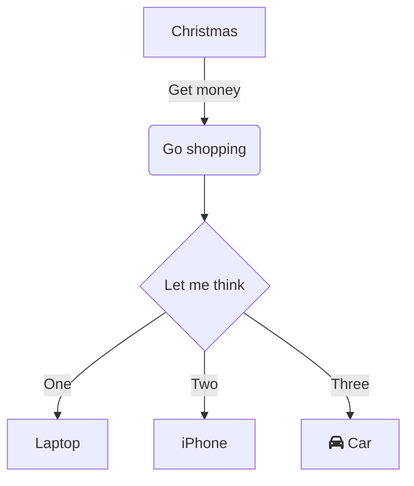

This is my test post on the new blog.

### Content Organization

Here is a placeholder for a co-located image:



Diagram:

```mermaid
flowchart TD
    A[Christmas] -->|Get money| B(Go shopping)
    B --> C{Let me think}
    C -->|One| D[Laptop]
    C -->|Two| E[iPhone]
    C -->|Three| F[fa:fa-car Car]
```

Here is the `variable_name` styled.