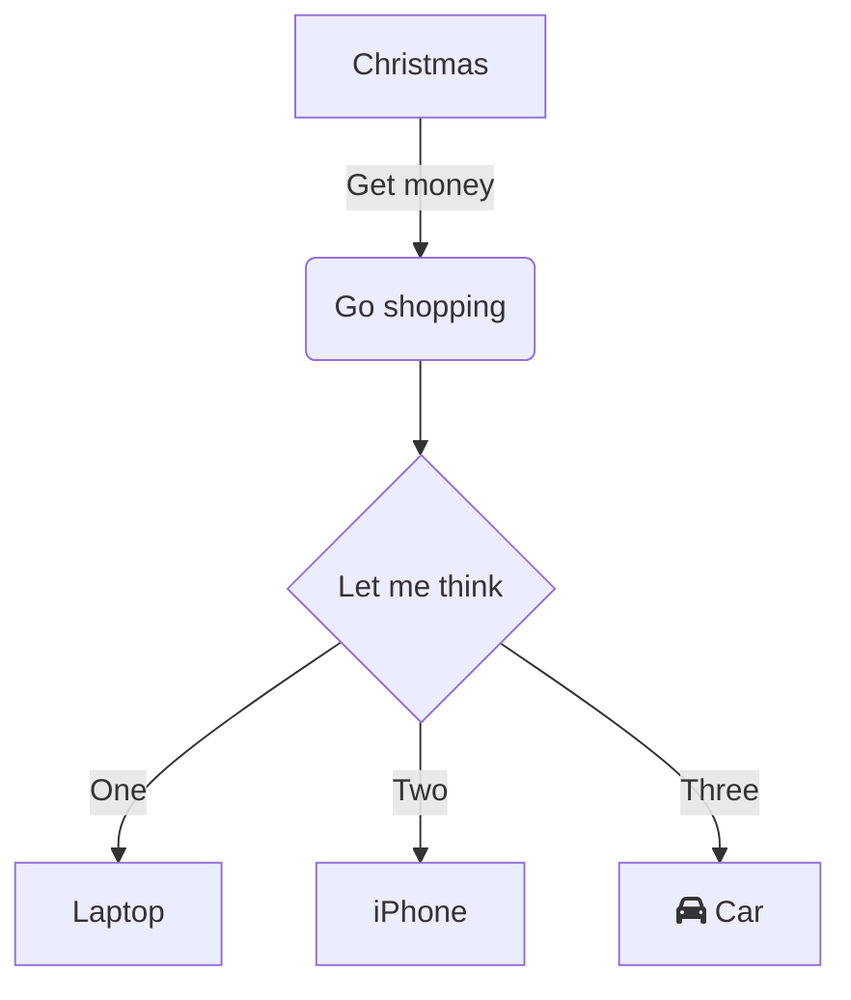

## Head 2.1

This is a quick note. Short bytes are for small thoughts, code snippets, or quick tips that don't require a full-length blog post.

### Head 3.1

test text

#### Head 4.1

lorem impsum

## Head 2.2
